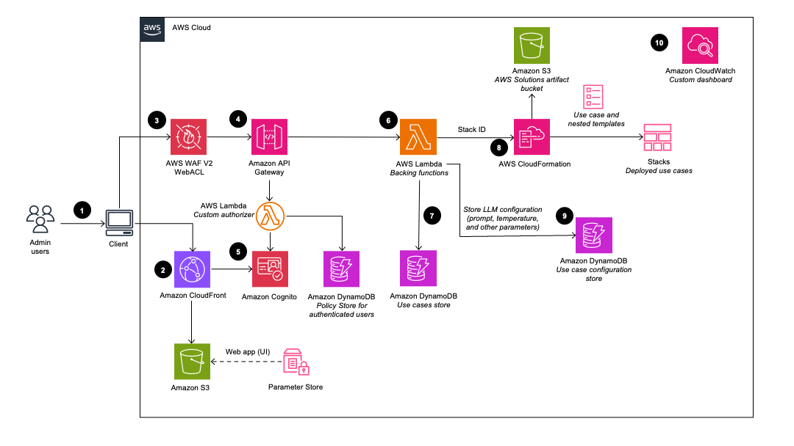

| **[✨ Generative AI Application Builder on AWS](https://aws.amazon.com/solutions/implementations/generative-ai-application-builder-on-aws/)** | **[🚧 Feature request](https://github.com/aws-solutions/generative-ai-application-builder-on-aws/issues/new?assignees=&labels=enhancement&template=feature_request.md&title=)** | **[🐛 Bug Report](https://github.com/aws-solutions/generative-ai-application-builder-on-aws/issues/new?assignees=&labels=bug&template=bug_report.md&title=)** | **[📖 Implementation Guide](https://docs.aws.amazon.com/solutions/latest/generative-ai-application-builder-on-aws/solution-overview.html)** |

> **_NOTE:_**

-   If you want to use the solution without any custom changes, navigate to [Solution Landing Page](https://aws.amazon.com/solutions/implementations/generative-ai-application-builder-on-aws/) and click the "Launch in the AWS Console" in the Deployment options for a 1-click deployment into your AWS Console.
-   If you are upgrading from v1.4.x to the current version, please follow the steps in this [section](https://docs.aws.amazon.com/solutions/latest/generative-ai-application-builder-on-aws/update-the-solution.html) of the implementation guide.

The [Generative AI Application Builder on AWS](https://aws.amazon.com/solutions/implementations/generative-ai-application-builder-on-aws/) solution (GAAB) provides a web-based management dashboard to deploy customizable Generative AI (Gen AI) use cases. This Deployment dashboard allows customers to deploy, experiment with, and compare different combinations of Large Language Model (LLM) use cases. Once customers have successfully configured and optimized their use case, they can take their deployment into production and integrate it within their applications.

The Generative AI Application Builder is published under an Apache 2.0 license and is targeted for novice to experienced users who want to experiment and productionize different Gen AI use cases. The solution uses [LangChain](https://www.langchain.com/) open-source software (OSS) to configure connections to your choice of Large Language Models (LLMs) for different use cases. The first release of GAAB allows users to deploy chat use cases which allow the ability to query over users' enterprise data in a chatbot-style User Interface (UI), along with an API to support custom end-user implementations.

Some of the features of GAAB are:

-   Rapid experimentation with ability to productionize at scale
-   Extendable and modularized architecture using nested [Amazon CloudFormation](https://aws.amazon.com/cloudformation/) stacks
-   Enterprise ready for company-specific data to tackle real-world business problems
-   Integration with [Amazon Bedrock](https://aws.amazon.com/bedrock/) and [Amazon SageMaker](https://aws.amazon.com/sagemaker/) as LLM providers
-   Multi-LLM comparison and experimentation with metric tracking using [Amazon CloudWatch](https://aws.amazon.com/cloudwatch/) dashboards
-   Growing list of model providers and Gen AI use cases

For a detailed solution implementation guide, refer to [The Generative AI Application Builder on AWS](https://docs.aws.amazon.com/solutions/latest/generative-ai-application-builder-on-aws/overview.html)

## On this page

-   [Architecture Overview](#architecture-overview)
-   [Deployment](#deployment)
-   [Source code](#source-code)
-   [SageMaker Model Input Documentation](#sagemaker-model-input-documentation)
-   [Creating a custom build](#creating-a-custom-build)

## Architecture Overview

There are 3 unique user personas that are referred to in the solution walkthrough below:

-   The **DevOps user** is responsible for deploying the solution within the AWS account and for managing the infrastructure, updating the solution, monitoring performance, and maintaining the overall health and lifecycle of the solution.
-   The **admin users** are responsible for managing the content contained within the deployment. These users gets access to the Deployment dashboard UI and is primarily responsible for curating the business user experience. This is our primary target customer.
-   The **business users** represents the individuals who the use case has been deployed for. They are the consumers of the knowledge base and the customer responsible for evaluating and experimenting with the LLMs.

> **_NOTE:_**

-   You have the option of deploying the solution as a VPC enabled configuration. With a VPC enabled configuration, you can choose
    -   if the solution should build the VPC for this deployment.
    -   if you would like to deploy the solution in a VPC existing in your AWS account.
-   To see the VPC related architecture diagrams, please visit the [implementation guide](https://docs.aws.amazon.com/solutions/latest/generative-ai-application-builder-on-aws/architecture-overview.html).

### Deployment Dashboard

When the DevOps user deploys the Deployment Dashboard, the following components are deployed in the AWS account:



1. The admin users can log in to the deployed Deployment Dashboard UI.
2. [Amazon CloudFront](http://aws.amazon.com/cloudfront/) delivers the web UI which is hosted in an [Amazon S3](http://aws.amazon.com/s3/) bucket.
3. [AWS WAF](https://aws.amazon.com/waf/) protects the APIs from attacks. This solution configures a set of rules called a web access control list (web ACL) that allows, blocks, or counts web requests based on configurable, user-defined web security rules and conditions.
4. The web UI leverages a set of REST APIs that are exposed using [Amazon API Gateway](https://aws.amazon.com/api-gateway/).
5. [Amazon Cognito](https://aws.amazon.com/cognito/) authenticates users and backs both the Cloudfront web UI and API Gateway. An [Amazon DynamoDB](https://aws.amazon.com/dynamodb/) table is used to store the [AWS IAM](https://aws.amazon.com/iam/) policy of authorized users.
6. [AWS Lambda](https://aws.amazon.com/lambda/) is used to provide the business logic for the REST endpoints. This Backing Lambda will manage and create the necessary resources to perform use case deployments using AWS Cloudformation.
7. [Amazon DynamoDB](https://aws.amazon.com/dynamodb/) is used to store the list of deployments.
8. When a new use case is created by the admin user, the Backing Lambda will initiate a CloudFormation stack creation event for the requested use case.
9. All of the LLM configuration options provided by the admin user in the deployment wizard are saved in DynamoDB. The deployment uses this DynamoDB table to configure the LLM at runtime.
10. Using [Amazon Cloudwatch](https://aws.amazon.com/cloudwatch/), this solution collects operational metrics from various services to generate custom dashboards that allow you to monitor the solution's performance and operational health.

```
Note: Although the Deployment dashboard can be launched in most AWS regions, the deployed use cases have some restrictions based on service availability. See Supported AWS Regions in the Implementation Guide for more details.
```

### Use Cases

Once the Deployment Dashboard is deployed, the admin user can then deploy multiple use case stacks. When a use case stack is deployed by the admin user, the following components are deployed in the AWS account:


1. Admin users deploy the use case using the Deployment dashboard. Business users log in to the use case UI.
2. [Amazon CloudFront](http://aws.amazon.com/cloudfront/) delivers the web UI which is hosted in an Amazon S3 bucket.
3. The web UI leverages a WebSocket integration built using [Amazon API Gateway](https://aws.amazon.com/api-gateway/). The API Gateway is backed by a custom Lambda Authorizer function, which returns the appropriate AWS IAM policy based on the Amazon Cognito group the authenticating user is part of. The policy is stored in Amazon DynamoDB.
4. [Amazon Cognito](https://aws.amazon.com/cognito/) authenticates users and backs both the Cloudfront web UI and API Gateway.
5. Incoming requests from the business user are passed from API Gateway to an [Amazon SQS queue](https://aws.amazon.com/sqs/) and then to the **_LangChain Orchestrator_**. The **_LangChain Orchestrator_** is a collection of Lambda functions and layers that provide the business logic for fulfilling requests coming from the business user. The queue enables the asynchronous operation of the API Gateway to Lambda integration. The queue passes connection information to the Lambda functions which will then post results directly back to the API Gateway websocket connection to support long running inference calls.
6. The **_LangChain Orchestrator_** uses Amazon DynamoDB to get the configured LLM options and necessary session information (such as the chat history).
7. If the deployment has a knowledge base configured, then the **_LangChain Orchestrator_** leverages [Amazon Kendra](https://aws.amazon.com/kendra/) or [Knowledge Bases for Amazon Bedrock](https://aws.amazon.com/bedrock/knowledge-bases/) to run a search query to retrieve document excerpts.
8. Using the chat history, query, and context from the knowledge base, the **_LangChain Orchestrator_** creates the final prompt and sends the request to the LLM hosted on [Amazon Bedrock](https://aws.amazon.com/bedrock/) or [Amazon SageMaker](https://aws.amazon.com/sagemaker/).
9. When the response comes back from the LLM, the **_LangChain Orchestrator_** streams the response back through the API Gateway WebSocket to be consumed by the client application.
10. Using Amazon CloudWatch, this solution collects operational metrics from various services to generate custom dashboards that allow you to monitor the deployment’s performance and operational health.

## Deployment

> **_NOTE:_**

-   To use Amazon Bedrock, you must request access to models before they are available for use. Refer to [Model access](https://docs.aws.amazon.com/bedrock/latest/userguide/model-access.html) in the Amazon Bedrock User Guide for more details.
-   You can also test the UI project locally by deploying the API endpoints and the rest of the infrastructure. To do so, follow either of the below two options and then refer [Deployment Dashboard](source/ui-deployment/README.md) and [Chat UI](source/ui-chat/README.md) project for details.

There are two options for deployment into your AWS account:

### 1. Using `cdk deploy`

Following are pre-requisites to build and deploy locally:

-   [Docker](https://www.docker.com/get-started/)
-   [Nodejs 20.x](https://nodejs.org/en)
-   [CDK v2.118.0](https://github.com/aws/aws-cdk)
-   [Python >= 3.11, <=3.12.1](https://www.python.org/)
    -   _Note: normal python installations should include support for `ensurepip` and `pip`; however, if running in an environment without these packages you will need to manually install them (e.g. a minimal docker image). See [pip's installation guide](https://pip.pypa.io/en/stable/installation/) for details._
-   [AWS CLI](https://aws.amazon.com/cli/)
-   [jq](https://jqlang.github.io/jq/)

**Note: Configure the AWS CLI with your AWS credentials or have them exported in the CLI terminal environment. In case the credentials are invalid or expired, running `cdk deploy` produces an error.**

**Also, if you have not run `cdk bootstrap` in this account and region, please follow the instructions [here](https://docs.aws.amazon.com/cdk/v2/guide/bootstrapping.html) to execute cdk bootstrap as a one time process before proceeding with the below steps.**

After cloning the repo from GitHub, complete the following steps:

> **_NOTE:_**

-   Please update the `cdk-asset-bucket` property in `source/infrastructure/cdk.json`. The value of this property should be the bucket name that `cdk bootstrap` process created. Unless a bucket name is configured, the `cdk bootstrap` process creates a bucket in the following
    format: `cdk-hnb659fds-assets-<aws-account-number>-<region>` (where <aws-account-number> is the AWS Account ID where the solution is being deployed in the specific <region>). The repo currently has the value set as the following:
    ```
    "cdk-asset-bucket": "cdk-hnb659fds-assets-123456789012-us-east-1"
    ```
    If deployed with this default value, the use case creation from deployment dashboards would fail.

```
  cd <project-directory>/source/infrastructure
  npm install
  npm run build
  cdk synth
  cdk deploy DeploymentPlatformStack --parameters AdminUserEmail=<replace with admin user's email>
```

**Note: Because `cdk deploy` is executed with a stack name, it does not synthesize the other CloudFormation stacks in the infrastructure folder. To ensure all stacks are synthesized based on the infrastructure code changes, please ensure to `cdk synth`. For a complete list of cdk commands that can be run, see [Toolkit commands](https://docs.aws.amazon.com/cdk/v2/guide/cli.html#cli-commands)**

For the deployment dashboard to deploy LLM chat use cases, you would additionally need to stage synthesized CDK assets (such as lambdas, synthesized CloudFormation templates, etc.) from the `source/infrastructure/cdk.out` directory to a configured S3 bucket in your account from where these resources will be pulled from at the time of deployment. To make it easy to stage these assets, you can use the `source/stage-assets.sh` script. This script should be run from the `source` directory.

```
cd <project-directory>/source
./stage-assets.sh
```

When run, the script looks like this:

```
>>> ./stage-assets.sh
This script should be run from the 'source' folder
The region to upload CDK artifacts to (default:us-east-1)?
>>> us-west-2
>>> All assets will be uploaded to cdk-hnb659fds-assets-123456789-us-west-2
>>> Do you want to proceed? (y/n) y
```

You must provide the full region name as the first input to the script as shown in the above example.

**Note: Assets must be staged every time there is a change in the codebase to have the most up-to-date staged assets. It is also recommend to run `cdk synth` before staging.**

### 2. Using a custom build

Refer section [Creating a custom build](#creating-a-custom-build)

## Source code

### Project structure

```
├── CHANGELOG.md
├── CODE_OF_CONDUCT.md
├── CONTRIBUTING.md
├── Config
├── LICENSE.txt
├── NOTICE.txt
├── README.md
├── buildspec.yml
├── deployment
│   ├── build-open-source-dist.sh
│   ├── build-s3-dist.sh
│   ├── cdk-solution-helper
│   ├── clean-for-scan.sh
│   ├── get-cdk-version.js
│   └── manifest.yaml
|   ├── run-unit-tests.sh                     [shell script that can run unit tests for the entire project]
├── pyproject.toml
├── pytest.ini
├── sonar-project.properties
└── source
    ├── images
    ├── infrastructure                       [CDK infrastructure]
    ├── lambda                               [Lambda functions for the application]
    ├── pre-build-lambda-layers.sh           [pre-builds lambda layers for the project]
    ├── scripts                              [standalone utility scripts]
    ├── stage-assets.sh
    ├── test
    ├── ui-chat                              [Web App project for chat UI]
    └── ui-deployment                        [Web App project for deployment dashboard UI]
└── docs
```

## SageMaker Model Input Documentation

The project provides a [docs folder](https://github.com/aws-solutions/generative-ai-application-builder-on-aws/tree/main/docs) which gives you access to sample SageMaker inputs. As SageMaker models can take in and output a variety of input and output schemas, respectively, the solution requests these values from the users to allow correct model invocation. This allows the solution to support a wide set of SageMaker models.

The input schemas are essentially your model's payload, with placeholders for the actual values. The placeholders enable replacing the actual model values at run-time and are represented by a keyword enclosed in angle brackets like: `<<prompt>>`. Note that `<<prompt>>` and `<<temperature>>` are reserved placeholders for the model prompt and temperatures respectively.

The model's output [JSONPath](https://goessner.net/articles/JsonPath/) provides the solution a path to retrieve the LLM's textual response from the model response.

Please always refer to model documentation and SageMaker JumpStart jupyter notebook samples to see the most up-to-date model payloads and supported parameters.

## Creating a custom build

### 1. Clone the repository

Run the following command:

`git clone https://github.com/aws-solutions/<repository_name>`

### 2. Build the solution for deployment

1. Install the dependencies:

```
cd <rootDir>/source/infrastructure
npm install
```

2. (Optional) Run the unit tests:

**Note: To run the unit tests, docker must be installed and running, and valid AWS credentials must be configured.**

```
cd <rootDir>/deployment
chmod +x ./run-unit-tests.sh
./run-unit-tests.sh
```

3. Configure the bucket name of your target Amazon S3 distribution bucket:

```
export DIST_OUTPUT_BUCKET=my-bucket-name
export VERSION=my-version
```

4. Build the distributable:

```
cd <rootDir>/deployment
chmod +x ./build-s3-dist.sh
./build-s3-dist.sh $DIST_OUTPUT_BUCKET $SOLUTION_NAME $VERSION $CF_TEMPLATE_BUCKET_NAME

```

Parameter details:

```
$DIST_OUTPUT_BUCKET - This is the global name of the distribution. For the bucket name, the AWS Region is added to the global name (example: 'my-bucket-name-us-east-1') to create a regional bucket. The lambda
artifacts should be uploaded to the regional buckets for the CloudFormation template to pick it up for deployment.

$SOLUTION_NAME - The name of This solution (example: generative-ai-application-builder-on-aws)
$VERSION - The version number of the change
$CF_TEMPLATE_BUCKET_NAME - The name of the S3 bucket where the CloudFormation templates should be uploaded
```

When you create and use buckets, we recommended that you:

-   Use randomized names or uuid as part of your bucket naming strategy.
-   Ensure that buckets aren't public.
-   Verify bucket ownership prior to uploading templates or code artifacts.

5. Deploy the distributable to an Amazon S3 bucket in your account.

**Note: You must have the AWS CLI installed.**

```
aws s3 cp ./global-s3-assets/ s3://my-bucket-name-<aws_region>/generative-ai-application-builder-on-aws/<my-version>/ --recursive --acl bucket-owner-full-control --profile aws-cred-profile-name
aws s3 cp ./regional-s3-assets/ s3://my-bucket-name-<aws_region>/generative-ai-application-builder-on-aws/<my-version>/ --recursive --acl bucket-owner-full-control --profile aws-cred-profile-name
```

### 3. Customize the Web App (UI) Projects

The solution includes two separate React-based web applications: the Deployment Dashboard UI and the Chat UI. Both user interfaces are built using Vite, a modern and fast build tool for modern web projects.

#### Prerequisites

-   Node.js (version 16 or later)
-   npm (usually included with Node.js)

#### Setting up the Local Development Environment

1. **Open a Terminal**

    - On Windows, you can use the built-in Command Prompt, PowerShell, or a terminal emulator like Git Bash.
    - On macOS or Linux, open the default terminal application.

2. **Navigate to the Source Directory**

    - Change to the `source` directory within the project root:
        ```
        cd <project-directory>/source
        ```

3. **Fetch and Update Runtime Config**

    - Run the provided `setup_local_dev_server.py` script with the appropriate arguments:
        ```
        python setup_local_dev_server.py --ui-project-type <ui_project_name> --website <website_url>
        ```
        - Replace `<ui_project_name>` with either `ui-chat` or `ui-deployment` depending on which UI project you want to set up.
        - Replace `<website_url>` with the URL of the website where the solution is deployed (e.g., `https://example.com`).
    - The script will fetch the runtime configuration used to configure AWS Amplify, which the project uses. It will also update the Cognito app client by adding the localhost address to the callbackurls and logouturls list, so it works with the Cognito hosted domain.
    - For example, to update the UI Chat project:

        ```
        python setup_local_dev_server.py --ui-project-type ui-chat --website https://example.com
        ```

        or

        ```
        python setup_local_dev_server.py -t ui-chat -w https://example.com
        ```

    - To update the UI Deployment project:

        ```
        python setup_local_dev_server.py --ui-project-type ui-deployment --website https://example.com
        ```

        or

        ```
        python setup_local_dev_server.py -t ui-deployment -w https://example.com
        ```

4. **Navigate to the UI Project Directory**

    - Change to the directory of the UI project you want to work with:

        ```
        cd ui-chat
        ```

        or

        ```
        cd ui-deployment
        ```

5. **Install Dependencies**

    - Install the required Node.js dependencies by running the following command in the project directory:

        ```
        npm install
        ```

6. **Start the Local Development Server**

    - In the project directory, run the following command to start the local Vite development server:

        ```
        npm start
        ```

    - The Deployment Dashboard UI development server will start at `http://localhost:5177`, and the Chat UI development server will start at `http://localhost:5178`.
    - If these ports are already in use on your machine, you can customize the `setup_local_dev_server.py` script to use different ports.

#### Customizing the Web App

With the local development environment set up, you can now customize the React components and functionality of the UI projects according to your requirements. The source code for the Deployment Dashboard UI is located in the `source/ui-deployment` directory, and the source code for the Chat UI is located in the `source/ui-chat` directory.

Follow the standard React development workflow to make changes to the code, and use the local Vite development server to preview your changes in real-time.

When you're ready to deploy your customized UI projects, follow the instructions in the main README file for building and deploying the solution using the AWS CDK.

## Anonymized data collection

This solution collects anonymized operational metrics to help AWS improve the quality and features of the solution. For more information, including how to disable this capability, please see the [implementation guide](https://docs.aws.amazon.com/solutions/latest/enhanced-document-understanding-on-aws/reference.html).

---

Copyright Amazon.com, Inc. or its affiliates. All Rights Reserved.

Licensed under the Apache License, Version 2.0 (the "License");
you may not use this file except in compliance with the License.
You may obtain a copy of the License at

    http://www.apache.org/licenses/LICENSE-2.0

Unless required by applicable law or agreed to in writing, software
distributed under the License is distributed on an "AS IS" BASIS,
WITHOUT WARRANTIES OR CONDITIONS OF ANY KIND, either express or implied.
See the License for the specific language governing permissions and
limitations under the License.

## Migrating from v1.X to v2.X

A script is included to migrate use cases created by v1.X to an upgraded v2.X deployment. See [the documentation](./docs/migration/migration.md)
