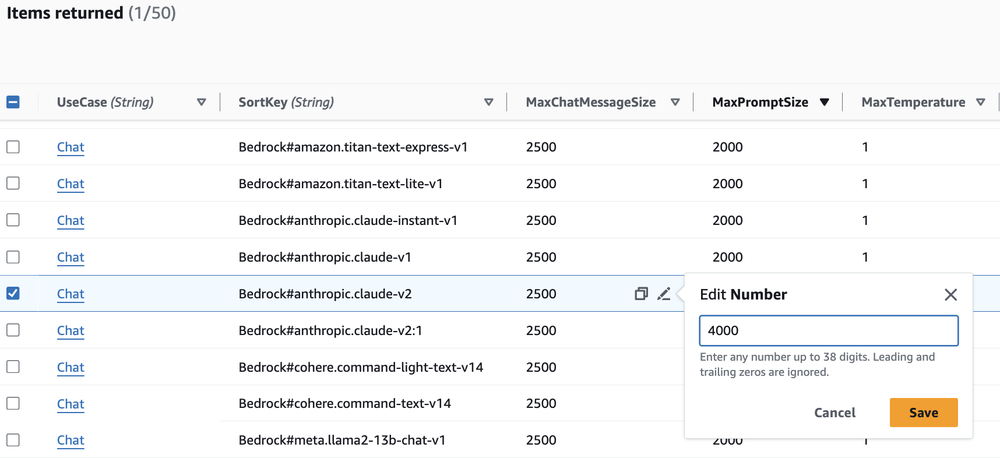

# Changing input restrictions of Prompt Template and Text use case chat messages

To change/increase the max length of the prompt template, browse to the model-info folder at [source/model-info](../source/model-info) and look for the appropriate model configuration file you require. The files are organized by use-case (e.g. chat, ragchat, etc.), by model provider (e.g. bedrock), and model-id (e.g. ai21-j2-mid, llama2-13b-chat-v1, etc.).
  - For example, if you want to update the configuration for non-RAG Text use cases using the Bedrock Anthropic claude-2 model, navigate to the [chat-bedrock-anthropic-claude-v2.json](../source/model-info/chat-bedrock-anthropic-claude-v2.json)
  
  
After you've identified the models you want to modify, update the appropriate keys such as `MaxPromptSize`, `MaxChatMessageSize`, etc. to the new values you wish to use.
  - `MaxPromptSize` controls the maximum number of characters allowed to be used by Admin/Business users when defining their prompt template
  - `MaxChatMessageSize` controls the maximum number of characters allowed to be used by Business users when sending messages using the chat interface

Once the values have been changed for all models of interest, you will need to build and deploy the solution. Instructions for that can be found in the [README.md](../README.md#deployment)

## Manual updates for experimentation only
> __*Note: use at your own discretion. Manually modifying values maintained by the solution causes a drift and may get overwritten by solution upgrades or other forms of stack updates. Use with caution and only with non-production deployments.*__

If you want to just quickly test some changes on an existing deployment and don't want to rebuild the entire solution, you can modify some values directly in DynamoDB to achieve a similar affect.

The values in the model-info files are stored in a DynamoDB table at deployment time. DynamoDB is then used by the Deployment dashboard and associated use cases at runtime. If you want to modify these values you can do the following:
  1. Go to the DynamoDB service page in your AWS console and search for a table with a name containing `ModelInfoStorage`
  2. Once you've found the right table for your Deployment dashboard, open the table and explore the table items
  3. Find the right row for your usecase, model provider, and model combination (e.g. - UseCase = `Chat`, SortKey = `Bedrock#anthropic.claude-v2`)
  4. Edit the default values of interest (e.g. `MaxChatMessageSize` or `MaxPromptSize`)

